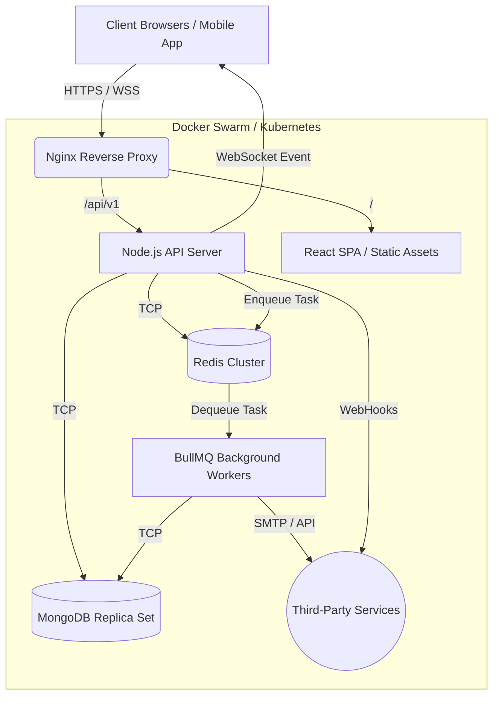
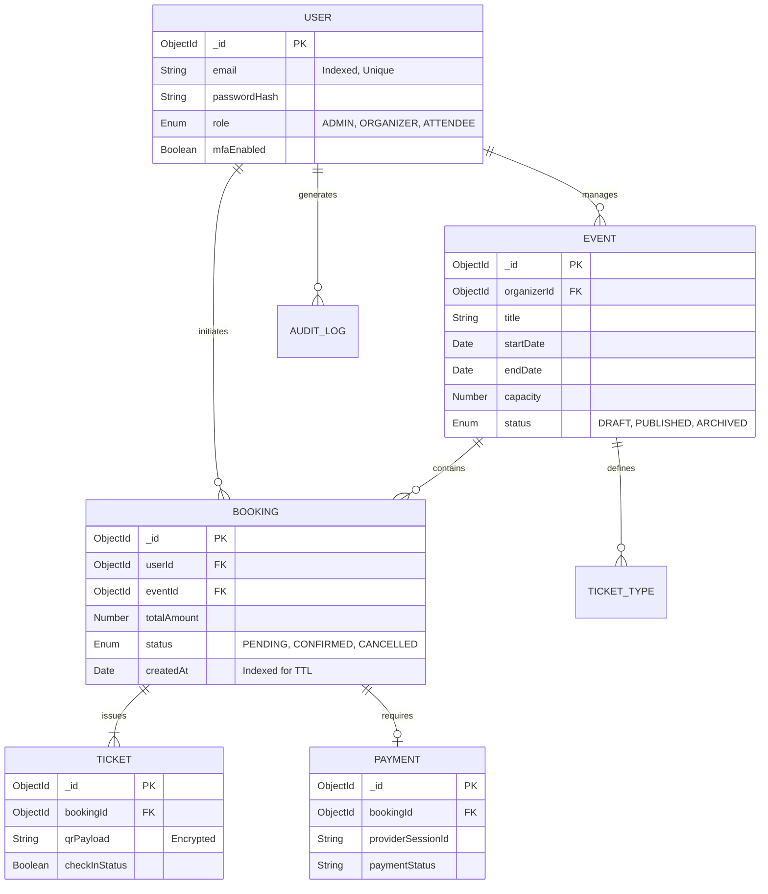

<div style="font-family: 'Segoe UI', Roboto, Helvetica, Arial, sans-serif; line-height: 1.6;">

# Event Booking Platform

**Project Name:** Event Booking Platform  
**Document Version:** 1.0.0  
**Classification:** Confidential / Enterprise Architecture  

<br>
<hr>
<br>

## 1. Executive Summary

EventSphere is an enterprise-grade event booking and management platform engineered to resolve the fragmentation present in modern event orchestration software. The platform unifies high-concurrency ticket reservation systems, real-time analytics, and role-based operational dashboards into a single ecosystem. It is designed for high availability, fault tolerance, and strict data consistency.

<br>
<hr>
<br>

## 2. Software Requirements Specification (SRS)

### 2.1 Functional Requirements
- **User Authentication:** The system must allow users to register, authenticate, and reset passwords securely using JWT and MFA (Multi-Factor Authentication).
- **Role-Based Access Control:** The system must enforce strict boundaries between `ADMIN`, `ORGANIZER`, and `ATTENDEE` roles.
- **Event Lifecycle Management:** Organizers must be able to draft, publish, edit, and archive events.
- **Ticket Reservation:** Attendees must be able to securely reserve tickets with a temporary hold mechanism to prevent overbooking.
- **Payment Processing:** The system must process payments securely via Stripe and handle asynchronous webhook confirmations.
- **Automated Communication:** The system must dispatch automated emails and SMS notifications for booking confirmations and event updates.

### 2.2 Non-Functional Requirements
- **High Concurrency:** The booking engine must handle thousands of simultaneous ticket requests without race conditions.
- **Performance:** API response times must remain under 200ms at the 95th percentile.
- **Scalability:** The architecture must be containerized to support horizontal scaling across a Kubernetes or Docker Swarm cluster.
- **Security:** All personally identifiable information (PII) must be encrypted at rest. The application must be protected against OWASP Top 10 vulnerabilities (XSS, CSRF, Injection).

<br>
<hr>
<br>

## 3. Technology Stack

The system utilizes a Monorepo architecture managed by **Turborepo** to enforce strict type-safety boundaries between micro-services and client applications.

- **Frontend Layer:** React 19, Vite, TypeScript, Redux Toolkit, React Query.
- **Backend Layer:** Node.js, Express v5, TypeScript, Socket.IO.
- **Data Persistence:** MongoDB 7.0 (Primary Store), Mongoose (ODM).
- **In-Memory Cache & Broker:** Redis, BullMQ (Asynchronous Task Queuing).
- **Infrastructure:** Docker, Docker Compose, Nginx, GitHub Actions (CI/CD).
- **External Integrations:** Stripe (Payments), Twilio (SMS/MFA), Nodemailer (SMTP).

<br>
<hr>
<br>

## 4. System Architecture

The architecture follows a classic multi-tier design, decoupling the client presentation layer from the core business logic and background processing workers.



<br>
<hr>
<br>

## 5. Data Architecture & ER Diagram

The data model utilizes document-oriented storage optimized for read-heavy workloads (e.g., event browsing) while maintaining strict ACID compliance for transactional operations (e.g., ticket booking) using MongoDB transactions.



<br>
<hr>
<br>

## 6. User Interface (UI/UX) Specifications

The presentation layer strictly adheres to a predefined Glassmorphism design system, ensuring accessibility (WCAG 2.1 AA) and responsive behavior across all viewport dimensions.

### 6.1 Analytics Dashboard Wireframe
*Figure 1: Organizer telemetry and real-time revenue metrics.*
<br>

<br><br>

### 6.2 Transaction Checkout Wireframe
*Figure 2: Frictionless booking flow and PCI-compliant payment portal.*
<br>


<br>
<hr>
<br>

## 7. Operations & Runbook

### 7.1 Local Environment Provisioning
The application is designed to be environment-agnostic. To provision the local development environment:

1. **Clone Repository & Install Dependencies:**
   ```bash
   git clone <repository_url>
   cd eventsphere
   npm ci
   ```

2. **Environment Configuration:**
   Ensure `.env` is populated according to the `.env.example` template.

3. **Container Orchestration:**
   The development environment bypasses local OS restrictions by containerizing all dependencies.
   ```bash
   docker-compose -f docker-compose.dev.yml up --build -d
   ```

### 7.2 CI/CD Pipeline
Continuous Integration is managed via GitHub Actions. Upon a push or pull request to the `main` branch, the pipeline automatically:
1. Provisions an Ubuntu runner.
2. Executes strict type-checking and ESLint static analysis.
3. Compiles the Turborepo workspace.
4. Executes the Vitest testing suite (Unit & Integration tests) with coverage reporting.

</div>
